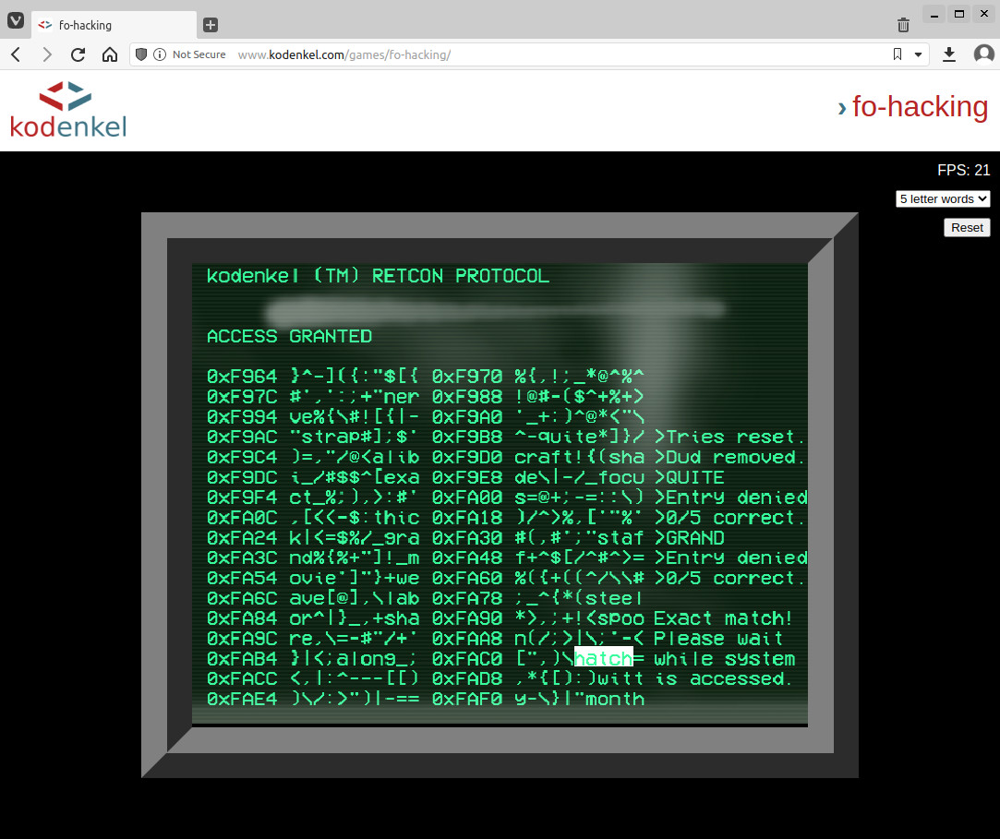

# kodenkel-fo-hacking

Clone of the Fallout hacking mini-game, rendered into a browser canvas.

You can try it out at: https://www.kodenkel.com/games/fo-hacking/



Have fun!

If you like this project, or found it useful:

[](https://www.buymeacoffee.com/kodenkel)

## Pre-requisites

- NodeJS
- npm

## Building

```
npm install
yarn build-all
yarn esbuild-browser:dev
```

Later on, just simply run the ./build.sh included.

## Running it Locally

Serve up the contents of the work directory with your favorite web server.

PHP comes with a simple server. To use it, run the following in the work directory:

```
php -S localhost:7000
```

Then visit localhost:7000 in a modern browser.
